# cAiGED
<!-- Subtitle -->
## Multimodal Edge-AI Guitar Chord Verification System

**cAiGED** is a custom embedded Edge-AI platform designed to investigate whether an embedded system can combine **visual and acoustic information** to determine whether a guitar chord is being played correctly.

The project combines embedded AI, computer vision, audio processing and high-performance PCB design around a custom hardware platform based on the **STM32N657X0H3Q**.

The initial application is deliberately constrained to five predefined guitar exercises associated with the CAGED system:

**C → A → G → E → D**

The project is not intended to be a general-purpose guitar transcription system or an arbitrary chord-recognition system. The objective is to investigate whether **physical fingering and acoustic output can be independently analysed and combined on an embedded device to verify a predefined guitar performance**.

### Core technologies

- STM32N6 / STM32N657X0H3Q
- Arm Cortex-M55
- ST Neural-ART NPU
- MIPI CSI-2
- Computer vision
- Audio AI
- Multimodal inference
- XSPI
- External embedded memory, if required
- USB, if required
- Gigabit Ethernet, if justified
- microSD, if required
- OLED
- High-speed PCB design
- VFBGA-264 BGA layout
- Signal integrity
- Power integrity
- EMC/EMI

[STM32N657X0 Datasheet](https://www.st.com/resource/en/datasheet/dm01125716.pdf)

[STM32N657X0 — STMicroelectronics](https://www.st.com/en/microcontrollers-microprocessors/stm32n657x0.html)

---

## Project Objective

The objective of cAiGED is to design and build a **custom embedded Edge-AI system capable of verifying predefined guitar chord performances using two independent sensing modalities**:

1. **Visual information** — observing the guitarist's physical finger/fretboard configuration through a camera.
2. **Acoustic information** — analysing the resulting guitar sound through a microphone.

The central research question is:

> **Can an embedded multimodal AI system determine whether an observed guitar fingering and resulting acoustic output are consistent with a predefined target chord?**

The initial application is based on the CAGED guitar system:

**C → A → G → E → D**

The long-term concept is an embedded guitar tutor that can present a target exercise, observe the guitarist's fingering, analyse the resulting sound, compare the two sources of information and provide immediate feedback.

The project is therefore **not simply an image-based guitar chord classifier**.

The visual and acoustic modalities remain independent until the fusion stage:

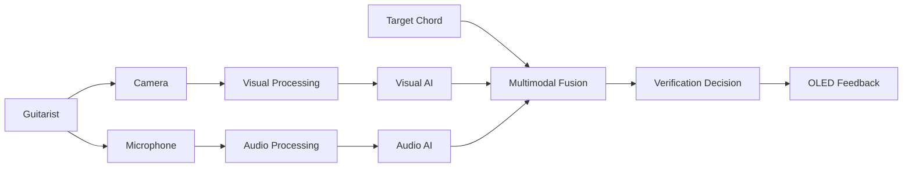

---

## Why cAiGED?

I have a long-standing interest in both **playing guitar and designing PCBs**.

cAiGED is where those two interests meet.

The guitar provides the real-world multimodal problem, while the need to solve that problem drives the development of a technically demanding embedded system and custom PCB.

The result is a project combining two areas that are personally and professionally relevant:

**guitar playing + electronics/PCB design**

The AI provides the application and engineering justification for the hardware, while the custom PCB is the principal engineering deliverable.

---

# System Concept

cAiGED is a **consistency verifier**, rather than a generic chord classifier.

A target exercise is selected. The player forms the corresponding chord and plays it.

The system then:

1. observes the physical fingering with a camera;
2. observes the resulting acoustic event with a microphone;
3. processes the visual and acoustic information independently;
4. compares both results with the target;
5. combines the evidence using a fusion layer;
6. produces a local **PASS / FAIL / UNCERTAIN** result.

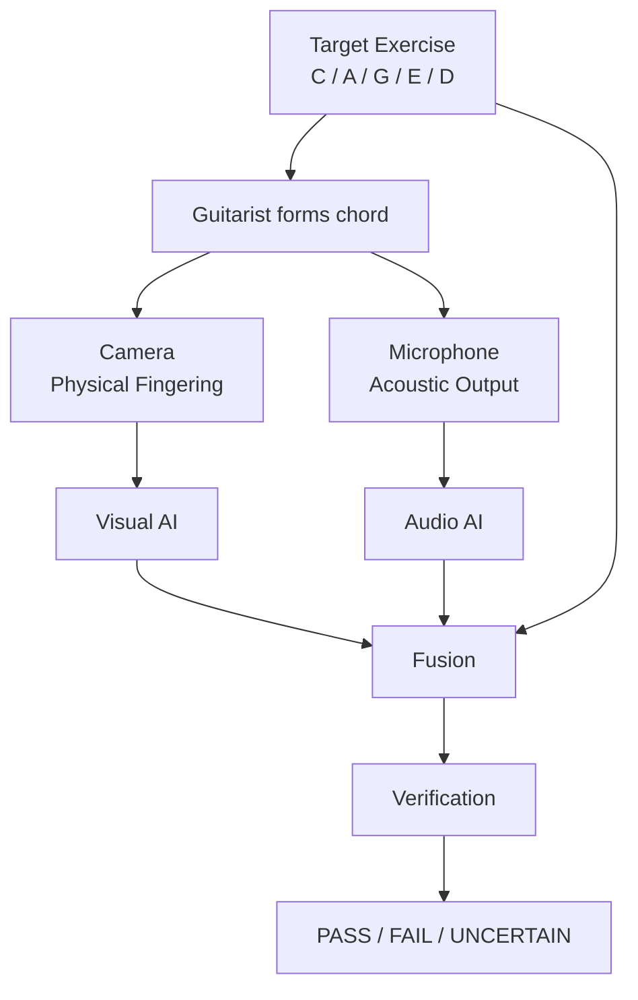

The two modalities provide complementary evidence.

The visual system can determine whether the observed fingering appears consistent with the target configuration.

The audio system can determine whether the resulting sound is acoustically consistent with the target chord.

For example:

**Target:** D
**Visual result:** D
**Audio result:** D

→ **Likely successful performance**

Another case could be:

**Target:** D
**Visual result:** D
**Audio result:** Dsus2 / uncertain

→ **Possible acoustic, articulation, muting or playing issue**

The exact diagnostic interpretation will be determined experimentally.

---

# Hardware Architecture

The custom cAiGED PCB is built around the **STM32N657X0H3Q** in the VFBGA-264 package.

The core hardware architecture is:

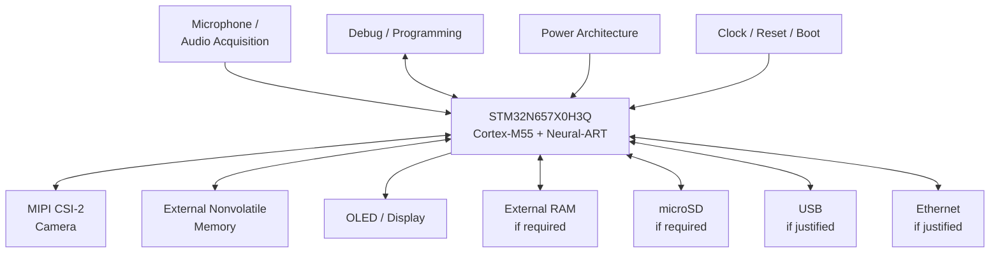

The final implementation of several peripheral blocks remains subject to engineering validation.

### Current hardware status

| Block                       | Status       | Purpose                                     |
| --------------------------- | ------------ | ------------------------------------------- |
| STM32N657X0H3Q              | Required     | Core processing and control                 |
| MIPI CSI-2 camera           | Required     | Visual sensing                              |
| Microphone/audio            | Required     | Acoustic sensing                            |
| External nonvolatile memory | Required     | Standalone firmware/model/storage           |
| External RAM                | TBD          | Only if memory/bandwidth budget requires it |
| OLED/display                | Required     | Local feedback                              |
| microSD                     | Optional     | Removable storage                           |
| USB                         | TBD          | Development, communication or data transfer |
| Ethernet                    | TBD/optional | Connectivity or PCB-design value            |
| Debug/programming           | Required     | Development and recovery                    |
| Temperature sensor          | Removed      | Not required by the research question       |

The design rule is:

> **A component is not included simply because it exists on a reference board. It must satisfy a cAiGED requirement, measurement or engineering constraint.**

---

# Why STM32N6?

The STM32N6 was selected because cAiGED requires significantly more computational capability than a conventional MCU application.

The STM32N657X0 provides:

* Arm Cortex-M55 processor operating up to 800 MHz
* ST Neural-ART neural processing accelerator
* Neural-network acceleration
* 4.2 MB contiguous SRAM
* external-memory interfaces
* MIPI CSI-2 camera connectivity
* image-processing capability
* USB
* Ethernet
* SDMMC
* audio interfaces
* hardware JPEG acceleration
* high-speed peripheral interfaces

The STM32N6 is therefore intended to be the **computational core of the embedded AI platform**, handling sensor acquisition, preprocessing, AI inference, multimodal processing and system control.

The MCU should not be treated as a miniature PC.

AI models, buffers and firmware must be designed around the available embedded memory, compute capability, bandwidth and real-time constraints.

[STM32N657X0 Datasheet](https://www.st.com/resource/en/datasheet/dm01125716.pdf)

[STM32N657X0 — STMicroelectronics](https://www.st.com/en/microcontrollers-microprocessors/stm32n657x0.html)

---

# PCB Design Objective

A major objective of cAiGED is to demonstrate advanced **professional PCB design capability through a complete embedded system**.

The project intentionally combines several challenging PCB technologies:

* 264-ball VFBGA
* 0.8 mm BGA pitch
* BGA escape routing
* External embedded memory, if required
* XSPI
* MIPI CSI-2
* USB, if retained
* Gigabit Ethernet, if retained
* High-speed clocks
* Multiple power domains
* Controlled impedance
* Signal integrity
* Power integrity
* EMC/EMI considerations
* Manufacturability
* Testability

The PCB will therefore be designed from the electrical requirements outward rather than treating high-speed routing as a final layout task.

The AI system provides the application context, but the **custom PCB is the principal engineering deliverable**.

---

# Reference Design Strategy

The STM32N6 hardware will not initially be designed from an empty schematic.

The primary development platform is STMicroelectronics' **NUCLEO-N657X0-Q**, whose main board is **MB1940**.

[NUCLEO-N657X0-Q — STMicroelectronics](https://www.st.com/en/evaluation-tools/nucleo-n657x0-q.html)

MB1940 is the primary reference for:

* STM32N6 implementation
* MCU power architecture
* clocking
* reset
* boot
* external Flash
* USB implementation
* 10/100 Ethernet implementation
* camera interface
* Nucleo-specific infrastructure
* general STM32N6 PCB implementation

However, MB1940 is **not** a reference for every subsystem in cAiGED.

In particular:

> **MB1940 does not contain an external RAM implementation.**

Therefore, it must not be used as the external-memory reference.

---

# External Memory Reference

External memory is treated separately from the MB1940 study.

The primary practical reference for STM32N6 external memory is the **STM32N6570-DK**.

The STM32N6570-DK implements a **256-Mbit Hexadeca-SPI PSRAM connected through the STM32N6 XSPI interface**.

This makes the DK the primary reference for understanding an STM32N6 external PSRAM implementation.

[STM32N6570-DK — STMicroelectronics](https://www.st.com/en/evaluation-tools/stm32n6570-dk.html)

The cAiGED external-memory decision will follow:

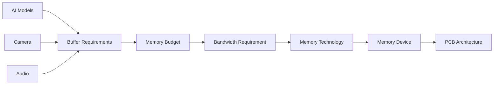

External RAM is therefore **not yet frozen**.

It may be required for:

* camera frame buffers;
* AI tensors;
* intermediate processing;
* audio buffers;
* graphics;
* larger working datasets.

However, the requirement must first be demonstrated quantitatively.

---

# Development Reference Workflow

The hardware development strategy is:

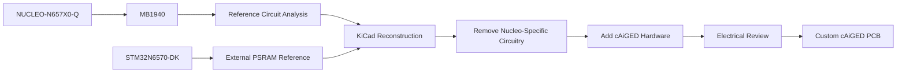

The development-board schematics are treated as engineering references, not as designs to copy blindly.

For every circuit, the engineering question is:

> **What function does this circuit provide, and does cAiGED actually need it?**

The design will distinguish between:

* circuits to retain;
* circuits to adapt;
* circuits to redesign;
* Nucleo-specific circuits;
* circuits to remove.

---

# Hardware Development Process

The complete hardware process follows:

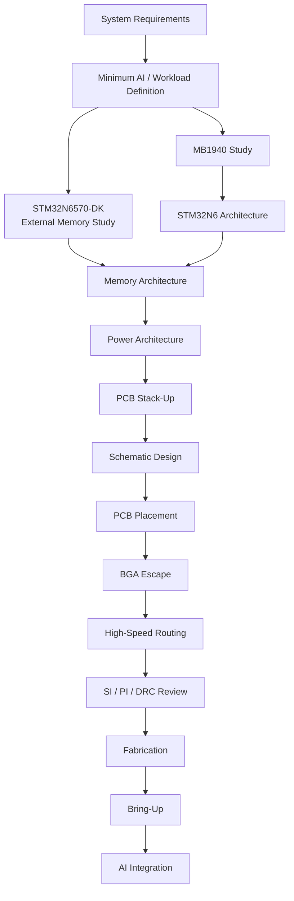

The custom PCB is being developed in **KiCad**.

---

# AI Architecture

The visual and acoustic processing paths remain independent.

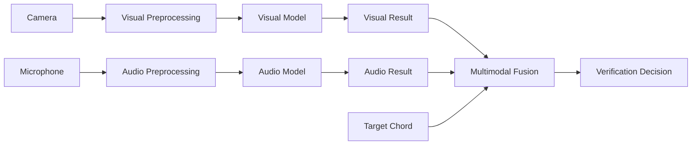

The first implementation intentionally avoids complex learned multimodal fusion.

The initial fusion layer will be implemented as ordinary embedded firmware logic using:

* target class;
* visual class;
* audio class;
* confidence values;
* uncertainty thresholds.

For example:

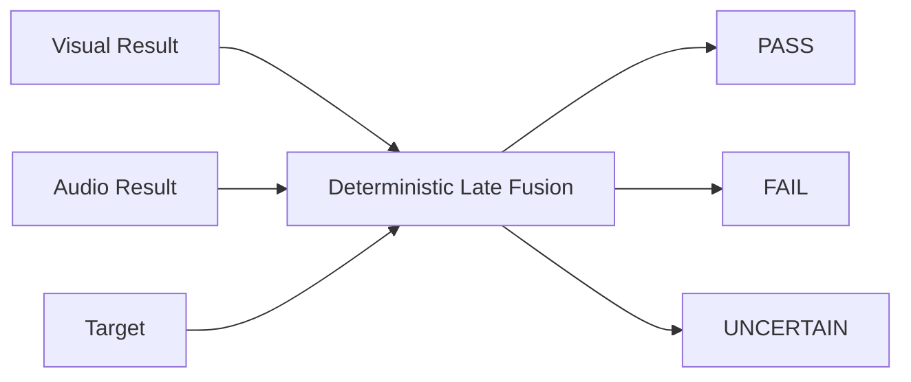

A simple first implementation may use rules such as:

> Visual result agrees with target + audio result agrees with target → PASS

while disagreements or insufficient confidence produce **FAIL** or **UNCERTAIN** depending on the experimentally defined decision rules.

A learned fusion model is optional future work.

It is not a requirement for the first hardware demonstrator.

---

# AI Development Philosophy

The AI component of the first hardware iteration is intentionally constrained.

The immediate objective is not to develop a large-scale state-of-the-art multimodal model.

Instead, the minimum viable AI stack must establish that the hardware can support:

* camera acquisition;
* audio acquisition;
* basic visual inference;
* basic audio inference;
* model execution;
* memory movement;
* required buffers;
* inference execution;
* multimodal result generation;
* local OLED feedback.

The smallest model that satisfies the required accuracy and latency should be preferred.

The AI workload will be developed sufficiently early to provide realistic hardware constraints, but the project will remain primarily focused on the custom PCB.

---

# Visual AI

The visual system is intended to provide evidence about the guitarist's physical fingering.

The first implementation should use a **controlled camera geometry** focused on the relevant fretboard region.

A compact classifier operating on a controlled region of interest may initially distinguish the five predefined configurations:

* C
* A
* G
* E
* D

A more structured approach can be investigated later, including:

* fretboard localization;
* finger detection;
* keypoint detection;
* string/fret occupancy;
* finger placement analysis;
* chord interpretation.

The initial objective is not arbitrary guitar-scene understanding.

The smallest model that provides useful performance within the embedded constraints should be preferred.

---

# Audio AI

The audio system independently analyses the resulting guitar sound.

The initial acoustic task is constrained to classification among:

* C
* A
* G
* E
* D
* Unknown / uncertain

Candidate audio representations include:

* waveform;
* STFT;
* spectrogram;
* mel-spectrogram;
* chroma-like features.

The representation and model will be selected experimentally.

The first dataset should use a controlled microphone position and controlled playing procedure.

Environmental variation will be introduced only after the controlled baseline has been established.

---

# Multimodal Fusion

The visual and acoustic paths remain independent until after inference.

The initial fusion architecture is:

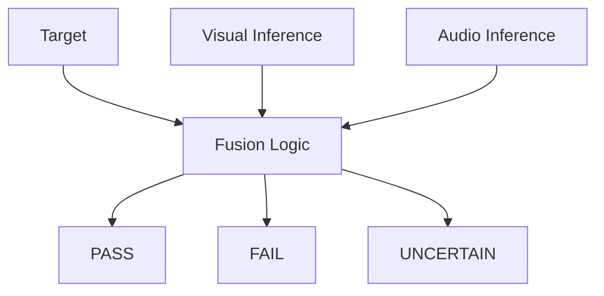

This is deliberately simple.

The project first needs to establish whether the two sensing modalities provide useful complementary information.

More sophisticated approaches such as:

* confidence-weighted fusion;
* probabilistic fusion;
* learned fusion;
* temporal multimodal models;

may be investigated later.

They are not required for the first implementation.

---

# Synchronization

Synchronization is an important part of the research problem.

Finger placement occurs before the acoustic event.

The guitar sound then persists after the strum.

Therefore, the system should not assume that one camera frame and one audio sample occur simultaneously.

Instead, the system can use an observation window:

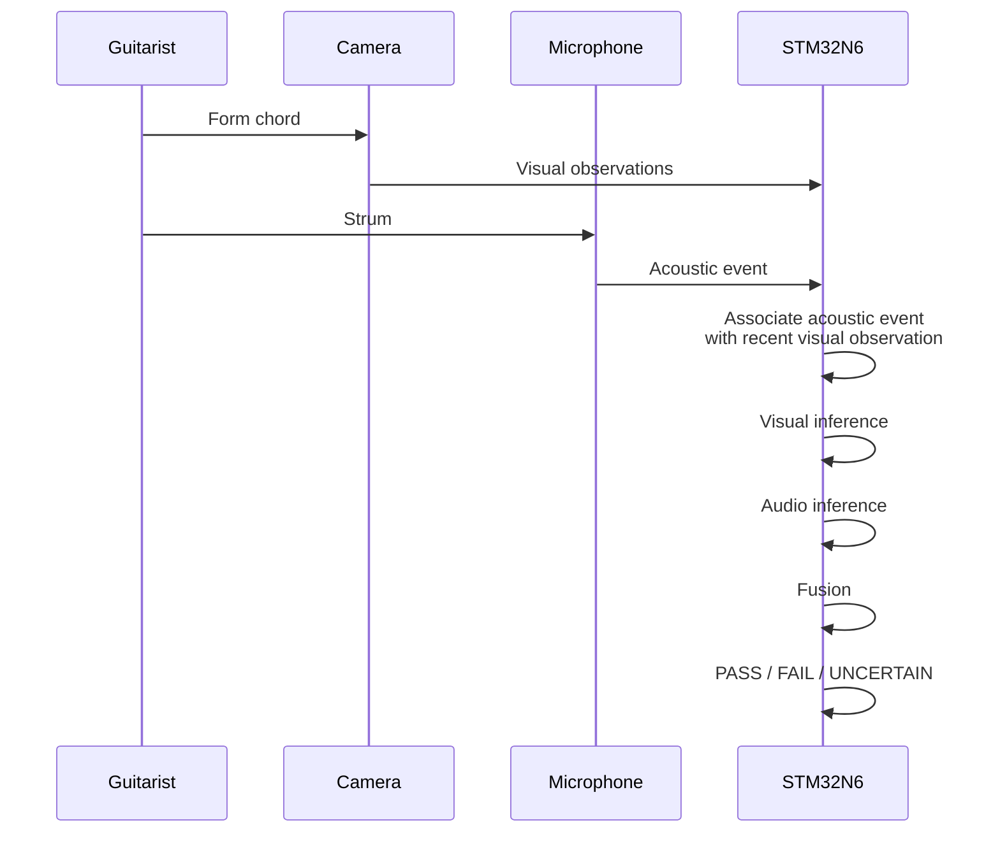

The exact observation window, acoustic event detection and temporal association strategy will be validated experimentally.

---

# CAGED Learning Interaction

The initial exercise sequence remains:

**C → A → G → E → D**

The system selects a target exercise and waits for the player to form and play the chord.

The complete interaction is:

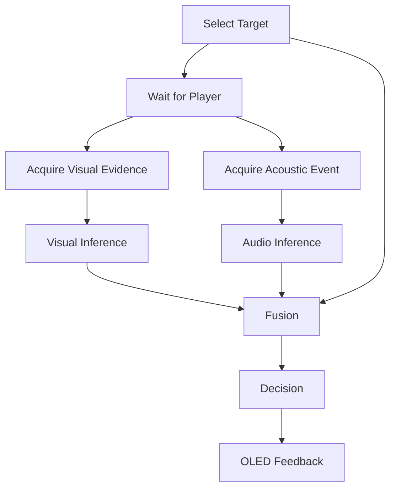

The tutor behaviour is a demonstration layer.

It should not expand the initial hardware scope.

---

# Ethernet

Ethernet is currently **not a required part of the chord-verification concept**.

It remains an optional interface because it may provide:

* connectivity;
* development functionality;
* data transfer;
* diagnostics;
* additional high-speed PCB-design experience.

An important distinction exists between the Nucleo and the proposed custom board.

### MB1940 Ethernet

The MB1940/Nucleo uses:

* external Ethernet PHY;
* 10/100 Ethernet;
* RMII.

It is therefore **not a Gigabit Ethernet reference implementation**.

### cAiGED Gigabit Ethernet

If Gigabit Ethernet is retained, the custom board requires:

* a Gigabit-capable PHY;
* the appropriate STM32N6 RGMII architecture;
* appropriate magnetics;
* appropriate differential routing;
* appropriate isolation and EMC considerations.

The MB1940 RMII implementation cannot simply be copied and labelled as Gigabit Ethernet.

The decision is therefore:

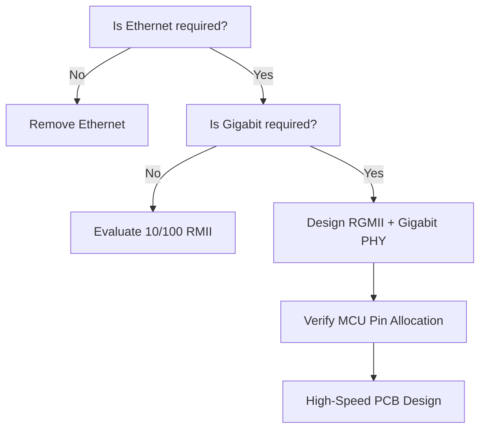

### Pin-sharing constraint

STM32N6 RGMII signals use MCU pins that are also associated with certain display and parallel-camera alternate functions.

This does **not** conflict with the planned MIPI CSI-2 camera because the MIPI CSI-2 interface uses dedicated D-PHY pins.

It becomes relevant if a future revision adds:

* an RGB/LTDC display;
* a parallel DCMI/PSSI camera.

Any such future change must therefore be checked against the STM32N6 alternate-function tables before the pin assignment is frozen.

---

# USB

USB remains useful, but its role is not yet frozen.

Potential roles include:

* development;
* PC communication;
* data transfer;
* configuration;
* diagnostics.

USB is not required for the core multimodal inference concept.

It should only become part of the final architecture once a concrete workflow justifies it.

---

# microSD

microSD is considered **removable storage**, not primary AI memory.

Potential uses include:

* datasets;
* recordings;
* captured test data;
* logs;
* configuration;
* experimental results.

The AI runtime should use internal or appropriate external memory for high-bandwidth processing.

microSD should not be treated as a substitute for inference memory.

---

# OLED and User Interface

A small OLED/display provides immediate local feedback.

The minimum interface should communicate:

* target chord;
* verification result;
* PASS;
* FAIL;
* UNCERTAIN.

Additional information may include:

* visual classification;
* acoustic classification;
* confidence;
* diagnostic information.

The display technology, resolution, interface and refresh rate remain **TBD**.

A small SPI or I²C OLED is currently preferred from a scope perspective because it avoids unnecessarily increasing display complexity.

---

# Memory Architecture

Memory is a key dependency between the AI workload and the hardware architecture.

The system separates memory according to function:

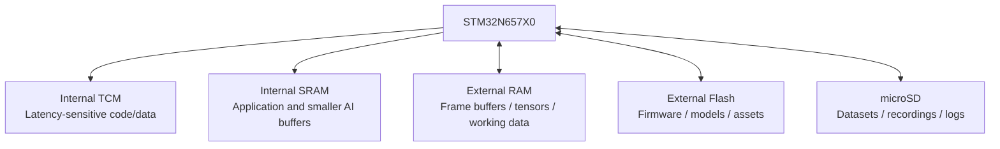

External RAM is optional until the memory and bandwidth requirements demonstrate that it is necessary.

The memory-selection process is:

1. determine model size;
2. determine tensor requirements;
3. determine camera frame-buffer requirements;
4. determine audio buffering;
5. determine graphics requirements;
6. calculate total memory requirement;
7. calculate bandwidth requirements;
8. determine whether internal SRAM is sufficient;
9. if not, select a compatible external-memory architecture.

The STM32N6570-DK PSRAM implementation is the primary practical reference for this external-memory decision.

---

# Schematic Design

The schematic will be developed by reconstructing and adapting the relevant portions of the ST reference designs while incorporating cAiGED-specific requirements.

The expected architecture includes:

1. STM32N657X0H3Q
2. MCU power
3. Clocking
4. Reset
5. Boot configuration
6. Debug/programming
7. External nonvolatile memory
8. External RAM, if required
9. MIPI CSI-2 camera
10. Audio acquisition
11. OLED
12. USB, if required
13. Ethernet, if required
14. microSD, if required
15. Test points
16. Power monitoring

Each subsystem will be documented with its engineering rationale.

---

# Power Architecture

The final power tree remains open.

MB1940 is used as a reference for:

* MCU power domains;
* decoupling;
* regulator implementation;
* power distribution concepts.

It is **not** treated as a component list to copy directly.

A complete rail and current budget must precede final regulator selection.

The budget must include whichever blocks survive the requirements freeze:

* STM32N6;
* external Flash;
* external RAM, if used;
* camera;
* audio;
* OLED;
* USB, if retained;
* Ethernet, if retained;
* microSD, if retained.

The final power architecture must also consider:

* sequencing;
* voltage tolerances;
* transient behaviour;
* protection;
* thermal dissipation;
* decoupling;
* power integrity;
* measurement points.

---

# Clock, Reset and Boot

Clock, reset and boot are essential infrastructure.

The final architecture will be derived from STM32N6 documentation and checked against the MB1940 implementation.

Required considerations include:

* system clock source;
* peripheral clocks;
* oscillator requirements;
* NRST;
* boot configuration;
* programming/debugging;
* recovery strategy.

---

# Debug and Testability

The final board does not need to reproduce the complete ST-LINK subsystem from the Nucleo.

However, it must retain robust programming, debugging and recovery access.

Expected provisions include:

* debug/programming connector;
* reset access;
* boot/recovery access;
* UART/logging where useful;
* power-rail test points;
* key peripheral test points;
* accessible measurement points for bring-up.

Integrated ST-LINK is therefore removed from the final PCB unless a specific requirement later justifies it.

---

# PCB Stack-Up

The PCB stack-up will be selected according to the actual fabrication process.

The final stack-up will define:

* number of copper layers;
* copper thickness;
* dielectric thickness;
* reference planes;
* power planes;
* controlled-impedance layers;
* differential-pair geometry;
* via technology;
* BGA escape strategy.

Controlled-impedance dimensions will be calculated using the actual fabricator stack-up rather than generic trace-width assumptions.

The stack-up must also provide suitable reference planes and return-current paths for high-speed interfaces.

---

# High-Speed PCB Design

High-speed interfaces will be treated individually according to their electrical requirements.

| Interface      | Main engineering considerations                             |
| -------------- | ----------------------------------------------------------- |
| STM32N6 BGA    | Escape routing, via strategy, power/ground distribution     |
| External PSRAM | Timing, topology, length/skew constraints, signal integrity |
| XSPI           | Controlled impedance, timing, length matching, return paths |
| MIPI CSI-2     | Differential impedance, skew, return path, signal integrity |
| USB            | Differential routing, impedance, return path, ESD           |
| Ethernet       | PHY, magnetics, isolation, differential routing, EMC        |
| Clocks         | Jitter, noise coupling, return paths                        |
| Power          | Power distribution network, decoupling, plane strategy      |

The final routing constraints will be derived from:

* STM32N6 documentation;
* selected memory datasheets;
* selected camera datasheet;
* selected PHY documentation;
* selected USB implementation;
* selected PCB manufacturer;
* actual stack-up.

---

# Signal Integrity, Power Integrity and EMC

High-speed interfaces must maintain:

* appropriate reference-plane continuity;
* controlled impedance where required;
* short return paths;
* appropriate differential-pair geometry;
* sensible separation;
* suitable termination where required.

Audio requires additional attention to:

* grounding;
* supply noise;
* digital coupling;
* microphone placement;
* analog/digital partitioning where applicable.

EMC/EMI considerations will be incorporated during:

* schematic design;
* stack-up selection;
* component placement;
* routing;
* power architecture.

They will not be treated as a final-stage correction.

---

# PCB Layout

PCB layout is one of the primary objectives of the project.

Particular attention will be given to:

* STM32N6 BGA fanout;
* power and ground via distribution;
* external memory placement;
* high-speed signal escape;
* MIPI CSI-2 routing;
* XSPI routing;
* USB routing;
* Ethernet routing, if retained;
* clock routing;
* return-current paths;
* power distribution;
* decoupling placement;
* EMI/EMC;
* manufacturability.

The repository will document the layout process rather than only showing the final PCB.

---

# KiCad Migration

Migration from the ST reference designs is an engineering verification task, not a one-click import.

Each reconstructed section must be checked against the corresponding official documentation.

Verification includes:

* symbols;
* footprints;
* net names;
* component values;
* power domains;
* pin assignments;
* connectivity;
* design rules;
* electrical characteristics.

Every deviation from MB1940 should have a documented reason.

For external memory, the STM32N6570-DK PSRAM implementation is used as the primary practical reference.

---

# Verification

The PCB design will undergo structured verification before fabrication.

Planned checks include:

* ERC;
* DRC;
* schematic review;
* footprint verification;
* BGA connectivity verification;
* power-net verification;
* differential-pair review;
* high-speed routing review;
* impedance verification;
* return-current-path review;
* SI considerations;
* PI considerations;
* manufacturing review;
* component availability review.

The verification process and results will be documented throughout development.

---

# Dataset Strategy

The first dataset will be controlled and small enough to support rapid iteration.

### Visual dataset

The visual dataset will contain the five predefined physical configurations:

* C
* A
* G
* E
* D

The initial setup should control:

* camera position;
* guitar position;
* fretboard region;
* lighting;
* background.

### Audio dataset

The audio dataset will contain corresponding acoustic events using a controlled recording configuration.

The initial setup should control:

* microphone position;
* guitar;
* playing procedure;
* strumming conditions;
* recording level.

After the baseline works, variation can be introduced systematically.

Potential variables include:

* additional players;
* lighting;
* different guitars;
* microphone position;
* playing strength;
* background noise;
* different environments.

Dataset leakage must be controlled.

Where possible, the final test set should contain genuinely unseen conditions.

---

# AI Model Strategy

The project does not require large models.

The objective is to find the **smallest model that provides useful performance within STM32N6 constraints**.

Important measurements include:

| Metric               | Purpose                                  |
| -------------------- | ---------------------------------------- |
| Visual-only accuracy | Evaluate visual modality independently   |
| Audio-only accuracy  | Evaluate acoustic modality independently |
| Fused accuracy       | Evaluate multimodal benefit              |
| Confusion matrix     | Identify class-specific failures         |
| Inference latency    | Determine real-time feasibility          |
| Model size           | Determine Flash requirements             |
| RAM footprint        | Determine memory architecture            |
| NPU workload         | Evaluate Neural-ART usage                |
| Cortex-M55 workload  | Evaluate CPU execution                   |
| Power                | Characterize embedded operation          |

The project does not depend on billion-parameter models.

Large 1B/2B/3B parameter experiments are explicitly outside the initial scope.

PC swap usage is also not treated as a meaningful embedded-AI metric.

---

# STM32N6 AI Deployment

The intended AI deployment flow is:


Useful measurements include:

* model size;
* memory usage;
* inference duration;
* NPU activity;
* Cortex-M55 activity;
* power consumption.

Comparing Neural-ART and Cortex-M55 execution can demonstrate the practical relevance of the selected MCU.

---

# Real-Time Firmware

DMA and concurrency should be used where measurements justify them.

FreeRTOS is **not a predetermined requirement**.

The first firmware implementation can remain relatively simple:

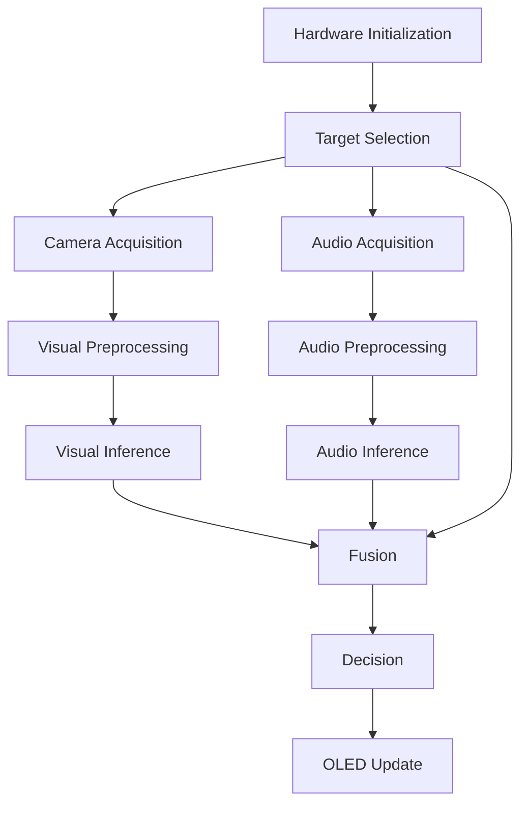

Storage and communications will be added only where required.

---

# Hardware / Software Boundary

The PCB should be informed by software requirements.

However, the complete AI system does not need to be finished before schematic work begins.

A preliminary model and workload estimate are sufficient to constrain major hardware decisions.

The key dependency is:

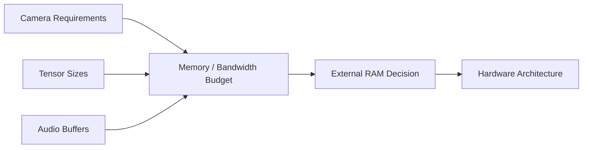

This allows the hardware architecture to be based on realistic workloads without requiring the complete AI research to be finished first.

---

# Development Strategy

The project is intentionally **PCB-focused**.

AI development provides the minimum evidence needed to make informed hardware decisions.

The custom PCB remains the principal engineering deliverable.

The project therefore prioritizes:

1. requirements;
2. reference-design analysis;
3. memory and power architecture;
4. schematic design;
5. stack-up;
6. BGA escape;
7. high-speed routing;
8. SI/PI;
9. DRC;
10. fabrication;
11. bring-up.

AI development proceeds in parallel only to the level necessary to constrain and validate the hardware.

---

# 26-Week Engineering Roadmap

| Phase                                   |     Duration |
| --------------------------------------- | -----------: |
| Minimum AI plumbing check               |      3 weeks |
| Requirements freeze                     |      2 weeks |
| MB1940 study                            |      5 weeks |
| Stack-up planning                       |       1 week |
| Schematic design                        |      7 weeks |
| PCB layout                              |      2 weeks |
| SI / PI / DRC review                    |      2 weeks |
| Fabrication wait + bring-up preparation |      3 weeks |
| Bring-up + AI integration               |       1 week |
| **Total**                               | **26 weeks** |

### Minimum AI plumbing check — 3 weeks

Prove:

* camera capture;
* small visual inference;
* microphone capture;
* small audio inference;
* visible result.

### Requirements freeze — 2 weeks

Freeze:

* functional requirements;
* electrical requirements;
* required peripherals;
* interfaces;
* preliminary memory requirements;
* power requirements.

### MB1940 study — 5 weeks

Analyse the MB1940 sheet by sheet.

For every circuit determine:

* function;
* reason it exists;
* whether cAiGED needs it;
* whether it should be retained;
* whether it should be adapted;
* whether it should be removed.

External memory is studied separately using the STM32N6570-DK PSRAM implementation.

### Stack-up planning — 1 week

Define:

* PCB manufacturer;
* manufacturing constraints;
* layer count;
* preliminary impedance strategy;
* BGA/via technology.

### Schematic design — 7 weeks

Develop and review the complete custom KiCad schematic.

### PCB layout — 2 weeks

Perform:

* placement;
* BGA escape;
* high-speed routing;
* power distribution;
* return-path optimization.

### SI / PI / DRC review — 2 weeks

Review:

* critical interfaces;
* impedance;
* timing;
* power integrity;
* signal integrity;
* DRC;
* manufacturability.

### Fabrication wait + bring-up preparation — 3 weeks

Use fabrication lead time productively for:

* firmware;
* test procedures;
* manufacturing documentation;
* bring-up preparation.

### Bring-up + AI integration — 1 week

Validate:

* hardware;
* power;
* MCU;
* memory;
* camera;
* audio;
* display;
* required interfaces;
* minimum multimodal pipeline.

---

# Fabrication & Bring-Up

The custom PCB will undergo a structured bring-up process.

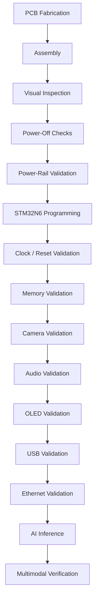

Optional interfaces such as USB, Ethernet and microSD will only be validated if they survive the requirements freeze.

A detailed bring-up log will be maintained as part of the engineering documentation.

---

# Performance Characterization

The embedded system will eventually be characterized using measurements such as:

| Metric                  | Result |
| ----------------------- | -----: |
| Visual accuracy         |    TBD |
| Audio accuracy          |    TBD |
| Multimodal accuracy     |    TBD |
| Model size              |    TBD |
| RAM usage               |    TBD |
| External RAM usage      |    TBD |
| Flash usage             |    TBD |
| Inference latency       |    TBD |
| Neural-ART workload     |    TBD |
| Cortex-M55 workload     |    TBD |
| CPU/NPU utilization     |    TBD |
| Memory bandwidth        |    TBD |
| External-memory traffic |    TBD |
| Power consumption       |    TBD |

The objective is to establish the relationship between:

**AI workload → memory requirements → hardware architecture → PCB implementation → measured performance**

---

# Portfolio Focus

The **custom PCB is the principal portfolio proof**.

The AI system provides the application and engineering justification for the hardware.

The project should demonstrate the complete engineering process rather than only the final PCB image.

Key portfolio deliverables include:

* STM32N6 schematic;
* memory architecture;
* power architecture;
* stack-up definition;
* impedance calculations;
* BGA escape strategy;
* MIPI CSI-2 routing;
* XSPI routing;
* USB routing, if retained;
* Ethernet routing, if retained;
* SI/PI analysis;
* DRC/ERC results;
* manufacturing outputs;
* bring-up procedure;
* validation results;
* engineering decision documentation.

---

# Verification Philosophy

The project follows a requirement-driven engineering approach.

For every MB1940 circuit:

> **What function does it perform, and does cAiGED require that function?**

For every new component:

> **What requirement does it satisfy, and what evidence supports its selection?**

For every optional subsystem:

> **What measurable benefit does it provide?**

For external memory:

> **Does the measured workload actually require it?**

For Ethernet:

> **Does the application require it, and if so, what Ethernet architecture is actually required?**

This prevents the custom PCB from becoming an unnecessary reproduction of the development board.

---

# Risk Register

| Risk                 | Potential consequence                                               | Mitigation                                                                                                         |
| -------------------- | ------------------------------------------------------------------- | ------------------------------------------------------------------------------------------------------------------ |
| External RAM         | Wrong memory technology/topology can block PCB design               | Use STM32N6570-DK PSRAM as the primary reference and select the final device only after memory/bandwidth budgeting |
| Memory bandwidth     | Insufficient bandwidth for camera/AI workload                       | Quantify frame, tensor and buffer bandwidth before freezing memory architecture                                    |
| Ethernet             | Incorrectly copying RMII while claiming Gigabit                     | Use the correct RGMII/Gigabit PHY architecture or remove the requirement                                           |
| Ethernet pin sharing | Future LTDC/parallel-camera addition could create pin conflicts     | Check STM32N6 alternate-function tables before adding those interfaces                                             |
| Vision               | Arbitrary scene recognition becomes a major computer-vision project | Fixed camera geometry and controlled ROI                                                                           |
| Audio                | Model learns recording conditions rather than chord characteristics | Controlled baseline followed by systematic environmental variation                                                 |
| Fusion               | Advanced multimodal ML expands project scope                        | Deterministic late fusion first                                                                                    |
| PCB complexity       | Too many optional peripherals increase first-board risk             | Keep optional interfaces removable until justified                                                                 |
| BGA routing          | 264-ball 0.8-mm package creates layout/manufacturing risk           | Freeze stack-up and via technology before detailed routing                                                         |
| Power                | Incorrect rail/current assumptions can cause bring-up failure       | Complete rail and current budget before regulator selection                                                        |
| SI/PI                | High-speed interfaces may fail despite logical correctness          | Perform stack-up, impedance, return-path and SI/PI review before fabrication                                       |
| AI workload          | Hardware architecture may be based on unrealistic assumptions       | Perform minimum AI plumbing and preliminary memory budgeting before schematic freeze                               |

---

# Project Status

**Current stage:** Hardware architecture / reference-design analysis

### Completed

* [x] Project concept defined
* [x] Multimodal camera + audio concept defined
* [x] C/A/G/E/D initial scope defined
* [x] STM32N657X0H3Q selected
* [x] NUCLEO-N657X0-Q selected as development platform
* [x] MB1940 selected as primary MCU/Nucleo reference
* [x] STM32N6570-DK identified as primary external-memory reference
* [x] PC DDR3/DDR3L SO-DIMM architecture excluded
* [x] Nucleo 10/100 RMII Ethernet distinguished from Gigabit Ethernet
* [x] Gigabit Ethernet RGMII treated as a separate architecture
* [x] PCB-focused development strategy established
* [x] 26-week roadmap established

### In progress / next

* [ ] Minimum AI plumbing
* [ ] Define exact C/A/G/E/D physical configurations
* [ ] Requirements freeze
* [ ] Quantify model and buffer memory requirements
* [ ] Determine whether external RAM is actually required
* [ ] Study STM32N6570-DK PSRAM implementation
* [ ] Select external RAM device, if required
* [ ] Define camera
* [ ] Define audio architecture
* [ ] Define OLED
* [ ] Define USB role
* [ ] Decide whether Ethernet is required
* [ ] Define power architecture
* [ ] MB1940 sheet-by-sheet analysis
* [ ] Stack-up definition
* [ ] KiCad schematic
* [ ] PCB layout
* [ ] SI / PI / DRC
* [ ] Fabrication
* [ ] Bring-up
* [ ] AI integration
* [ ] Final validation

---

# Immediate Engineering Tasks

The immediate development sequence is:

1. Define the five exact physical C/A/G/E/D chord configurations.
2. Prove camera acquisition on the NUCLEO-N657X0-Q.
3. Prove one small visual inference.
4. Prove microphone/audio acquisition.
5. Prove one small audio inference.
6. Estimate model, frame-buffer and audio-buffer memory requirements.
7. Study the STM32N6570-DK external PSRAM implementation.
8. Determine whether external RAM is actually necessary.
9. Select an STM32N6-compatible external-memory architecture if required.
10. Define the concrete purpose of USB.
11. Decide whether Ethernet is required.
12. If Gigabit Ethernet is retained, design around RGMII and a Gigabit PHY rather than copying MB1940 RMII.
13. Verify MCU alternate-function allocation.
14. Study MB1940 sheet by sheet.
15. Classify each circuit as required, optional, Nucleo-specific or redesign.
16. Define the power and clock architecture.
17. Freeze the PCB manufacturer and stack-up.
18. Build the custom KiCad schematic.
19. Perform schematic review before PCB layout.

---

# Final Simplified Project Concept

**cAiGED is an embedded multimodal guitar-chord verifier.**

A guitarist is presented with one of five target exercises:

**C, A, G, E or D**

The guitarist forms and plays the target chord.

A camera observes the physical fingering configuration.

A microphone observes the resulting guitar sound.

A visual AI model and an audio AI model operate independently.

Their outputs are combined by a simple fusion layer together with the target chord.

The system reports:

**PASS / FAIL / UNCERTAIN**

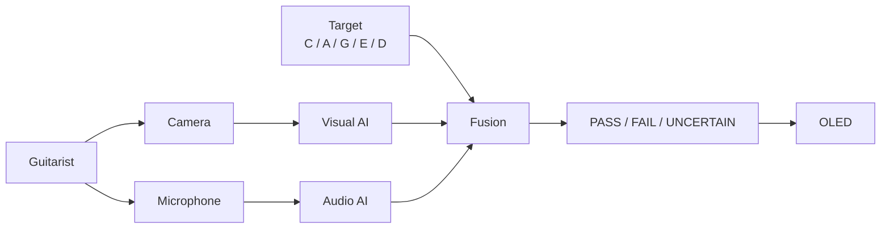

The system runs locally on the **STM32N657X0H3Q**.

The custom PCB provides the core MCU, camera, audio, display, required nonvolatile memory, debug infrastructure, power architecture and only the additional interfaces justified by the final requirements.

External RAM, Ethernet, USB and microSD remain optional architectural blocks unless requirements or measurements justify their inclusion.

If external RAM is required, it will use an STM32N6-compatible embedded-memory device, with the **STM32N6570-DK 256-Mbit Hexadeca-SPI PSRAM implementation** serving as the primary practical reference.

---

# Final Project Definition

**cAiGED — Multimodal Edge-AI Guitar Chord Verification System** is an embedded research and engineering project investigating whether visual evidence of guitar fingering and acoustic evidence of the resulting chord can be combined on an **STM32N657X0H3Q** to verify predefined guitar chord performances.

The initial application uses five predefined CAGED-related exercises:

**C → A → G → E → D**

Visual and acoustic inference remain independent before a simple fusion stage.

The final demonstrator provides local feedback through a small display.

The custom PCB is designed as a serious high-performance embedded system, demonstrating:

* STM32N6 BGA design;
* high-speed interfaces;
* memory architecture;
* power architecture;
* controlled impedance;
* signal integrity;
* power integrity;
* EMC/EMI;
* manufacturability;
* hardware bring-up.

PC DDR3/DDR3L RAM modules are explicitly excluded.

MB1940 is the primary reference for the STM32N6/Nucleo architecture and the circuits it actually implements.

The STM32N6570-DK is the primary reference for external memory, specifically the implemented **256-Mbit Hexadeca-SPI PSRAM over XSPI**.

Gigabit Ethernet is not inherited from the Nucleo. If retained, it requires the correct STM32N6 RGMII/Gigabit architecture.

Optional peripherals are not frozen until their function is established.

---

# Engineering Decision Rule

The project follows one fundamental rule:

> **Do not add a component because the reference board contains it. Do not add a feature because it sounds useful. Add it when a cAiGED requirement, measurement or engineering constraint demonstrates that it is needed.**

For every MB1940 circuit:

> **What function does it perform, and does cAiGED require that function?**

For every new component:

> **What requirement does it satisfy, and what evidence supports its selection?**

For external memory:

> **What workload requires it, and which STM32N6-compatible architecture satisfies that workload?**

For Ethernet:

> **What functionality requires it, and is the correct architecture RMII or RGMII/Gigabit?**

For every PCB feature:

> **What electrical or mechanical requirement justifies it?**

---

# Definition of First Success

A valid first demonstrator does not need to be a universal guitar tutor.

It is sufficient to:

1. select C/A/G/E/D;
2. acquire a camera observation;
3. acquire an acoustic event;
4. run compact visual inference;
5. run compact audio inference;
6. combine the outputs;
7. produce a local PASS/FAIL/UNCERTAIN result.

Once this works, the project can expand through:

* better visual models;
* better audio models;
* broader environmental variation;
* richer diagnostics;
* improved synchronization;
* confidence-weighted fusion;
* learned multimodal fusion;
* additional guitar exercises.

---

# Engineering Documentation

Detailed engineering documentation will be developed throughout the project.

### Requirements

System-level functional and electrical requirements defining what the final hardware must support.

### Reference Design Analysis

Circuit-by-circuit analysis of MB1940, documenting the purpose and decision for every relevant circuit.

### External Memory Analysis

Study of the STM32N6570-DK PSRAM implementation, including:

* interface;
* topology;
* power;
* timing;
* routing;
* placement;
* memory organization;
* relationship to cAiGED workload requirements.

### Hardware Architecture

Evolution from the ST reference architecture to the custom cAiGED architecture.

### Schematic

Complete KiCad schematic and engineering rationale for each subsystem.

### PCB Design

Documentation of:

* stack-up;
* impedance calculations;
* placement;
* BGA escape;
* high-speed routing;
* power distribution;
* return paths;
* manufacturability.

### Verification

Documentation of:

* ERC;
* DRC;
* connectivity;
* SI;
* PI;
* power review;
* manufacturing review.

### Bring-Up

Documentation of:

* initial power-up;
* measurements;
* failures;
* debugging;
* hardware modifications;
* validation.

### AI

Documentation of:

* datasets;
* visual model;
* audio model;
* deployment;
* quantization;
* inference performance;
* multimodal fusion.

---


# References

### STM32N6

* [STM32N657X0 Datasheet](https://www.st.com/resource/en/datasheet/dm01125716.pdf)
* [STM32N657X0 — STMicroelectronics](https://www.st.com/en/microcontrollers-microprocessors/stm32n657x0.html)

### Development Platform

* [NUCLEO-N657X0-Q — STMicroelectronics](https://www.st.com/en/evaluation-tools/nucleo-n657x0-q.html)
* [UM3417 — STM32N6 Nucleo-144 Board User Manual](https://www.st.com/resource/en/user_manual/um3417-stm32n6-nucleo144-board-mb1940-stmicroelectronics.pdf)

### External Memory Reference

* [STM32N6570-DK — STMicroelectronics](https://www.st.com/en/evaluation-tools/stm32n6570-dk.html)

---

# License

To be defined.

```
```
