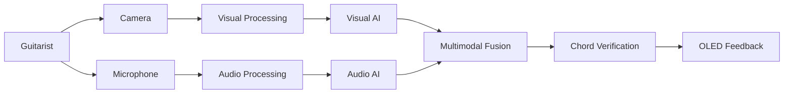
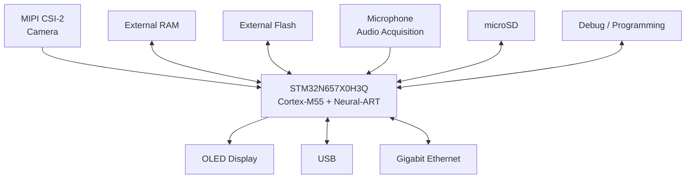
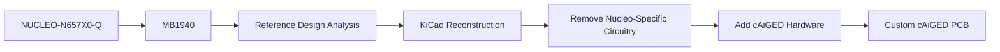
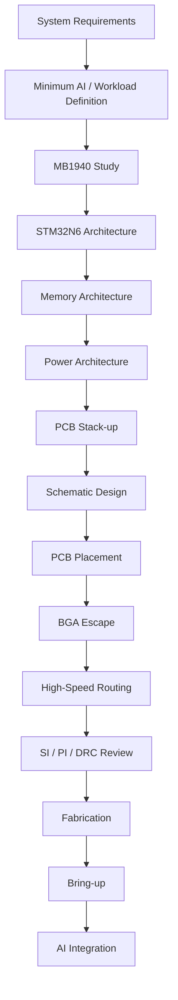
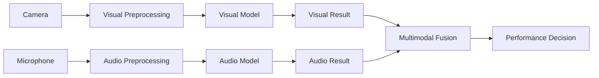
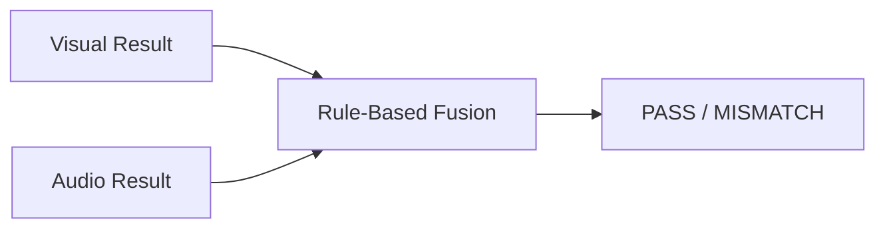
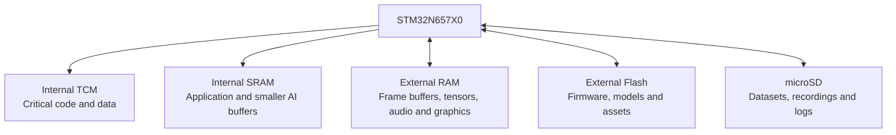
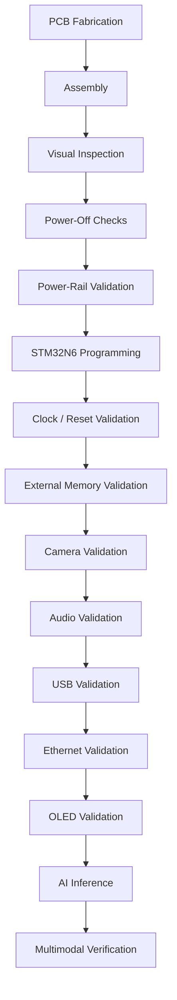

# cAiGED

## Multimodal Edge-AI Guitar Chord Verification System

**cAiGED** is a custom embedded Edge-AI platform designed to investigate whether an embedded system can combine **visual and acoustic information** to determine whether a guitar chord is being played correctly.

The project combines embedded AI, computer vision, audio processing and high-speed PCB design around a custom hardware platform based on the **STM32N657X0H3Q**.

**Core technologies**

- STM32N6 / STM32N657X0H3Q
- Arm Cortex-M55
- ST Neural-ART NPU
- MIPI CSI-2
- Computer vision
- Audio AI
- Multimodal inference
- External high-speed memory
- XSPI
- USB
- Gigabit Ethernet
- microSD
- OLED
- High-speed PCB design
- VFBGA-264 BGA layout
- Signal and power integrity

[STM32N657X0 Datasheet](https://www.st.com/resource/en/datasheet/dm01125716.pdf)

---

## Project Objective

The objective of cAiGED is to design and build a **custom embedded Edge-AI system capable of verifying guitar chord performance using two independent sensing modalities**:

1. **Visual information** — observing the guitarist's physical finger/fretboard configuration through a camera.
2. **Acoustic information** — analysing the resulting guitar sound through a microphone.

The central research question is:

> **Can an embedded AI system combine visual and acoustic information to determine whether a guitar is being played correctly?**

The initial application is based on the **CAGED guitar system**:

**C → A → G → E → D**

The long-term concept is an embedded guitar tutor that can present or expect a chord, observe the guitarist's fingering, analyse the resulting sound, compare the two sources of information and provide immediate feedback.

The project is therefore not intended to be simply an image-based guitar chord classifier.

The objective is to investigate whether **physical fingering and acoustic output can be combined on an embedded device to verify a musical performance**.

---

## Why cAiGED?

I have a long-standing interest in both **playing guitar and designing PCBs**.

cAiGED is where those two interests meet: the guitar provides the real-world multimodal problem, while the need to solve that problem drives the design of a technically demanding embedded system and custom PCB.

The result is a project that combines something I enjoy doing creatively with something I work on professionally: **guitar playing and electronics/PCB design in the same system**.

---

## System Concept

The fundamental concept is to process the visual and acoustic information independently before combining their outputs.



The two modalities provide complementary information.

The visual system can investigate the guitarist's physical finger/fretboard configuration, while the audio system independently evaluates the resulting acoustic output.

For example:

**Target:** D

**Visual result:** D
**Audio result:** D

→ **MATCH / PASS**

A more interesting case is:

**Target:** D

**Visual result:** D
**Audio result:** Dsus2

→ **Possible fingering / articulation / acoustic mismatch**

The exact diagnostic behaviour will be developed experimentally.

---

# Hardware Architecture

The custom cAiGED PCB is built around the **STM32N657X0H3Q**, a VFBGA-264 device with a 0.8 mm pitch.



The final implementation of several peripheral blocks remains subject to engineering validation.

Current hardware blocks include:

* STM32N657X0H3Q
* External RAM
* External Flash
* MIPI CSI-2 camera interface
* Microphone / audio acquisition
* OLED display
* microSD
* USB
* Gigabit Ethernet
* Debug/programming interface
* Power architecture
* Clock and reset circuitry
* High-speed PCB infrastructure

---

# Why STM32N6?

The STM32N6 was selected because cAiGED requires substantially more computational capability than a conventional MCU application.

The STM32N657X0 provides:

* Arm Cortex-M55 processor operating up to 800 MHz
* ST Neural-ART neural processing accelerator
* up to 600 GOPS neural-network processing
* 4.2 MB contiguous SRAM
* external memory interfaces
* MIPI CSI-2 camera interface
* integrated image signal processor
* Ethernet
* USB
* SDMMC
* audio interfaces
* hardware JPEG acceleration
* extensive high-speed peripheral interfaces

The STM32N6 is therefore not simply the system controller.

It is intended to be the **computational core of the embedded AI platform**, handling sensor acquisition, preprocessing, AI inference, multimodal processing and system control.

[STM32N657X0 Datasheet](https://www.st.com/resource/en/datasheet/dm01125716.pdf)

[STM32N657X0 — STMicroelectronics](https://www.st.com/en/microcontrollers-microprocessors/stm32n657x0.html)

---

# PCB Design Objective

A major objective of cAiGED is to demonstrate advanced **professional PCB design capability through a complete embedded system**.

The project intentionally combines several challenging PCB technologies in one design:

* 264-ball VFBGA
* 0.8 mm BGA pitch
* External high-speed memory
* XSPI
* MIPI CSI-2
* USB
* Gigabit Ethernet
* High-speed clocks
* Multiple power domains
* Controlled impedance
* Signal integrity
* Power integrity
* EMC/EMI considerations
* Thermal considerations
* Manufacturability
* Testability

The PCB will therefore be designed from the electrical requirements outward rather than treating high-speed routing as a final layout task.

---

# Reference Design: MB1940

The STM32N6 hardware will not initially be designed from an empty schematic.

The primary hardware development platform is STMicroelectronics' **NUCLEO-N657X0-Q**, whose main board is **MB1940**.

[NUCLEO-N657X0-Q — STMicroelectronics](https://www.st.com/en/evaluation-tools/nucleo-n657x0-q.html)

The development strategy is:



MB1940 is treated as a **reference implementation**, not as the final cAiGED schematic.

For every circuit, the engineering question is:

> **What function does this circuit provide, and does cAiGED actually need it?**

The design will therefore distinguish between:

* circuits that should be retained;
* circuits that should be adapted;
* circuits that should be redesigned;
* circuits that are Nucleo-specific;
* circuits that can be removed.

This approach avoids blindly reproducing the development board.

---

# Hardware Development Process

The hardware development process follows:



The custom PCB is being developed in **KiCad**.

---

# AI Architecture

The AI architecture is intentionally being developed independently from the PCB initially.

The visual and acoustic paths remain separate:



The first implementation will use a deliberately simple fusion strategy.



For the initial implementation, a simple comparison such as:

> **Visual result = Audio result → PASS**

is sufficient to demonstrate the multimodal concept.

More sophisticated approaches such as confidence-weighted fusion or learned fusion may be investigated later.

---

# AI Development Philosophy

The AI component of the first hardware iteration is intentionally constrained.

The immediate objective is not to spend the majority of the project developing a large dataset or state-of-the-art multimodal model.

Instead, the minimum viable AI stack will establish that the hardware can support:

* camera acquisition;
* audio acquisition;
* basic visual inference;
* basic audio inference;
* Neural-ART execution;
* memory movement;
* required buffers;
* inference execution;
* multimodal result generation;
* local OLED feedback.

More advanced model development can subsequently build on the hardware platform.

This approach allows the PCB to be designed around measurable embedded workloads rather than speculative AI requirements.

---

# Memory Architecture

Memory is a key part of the relationship between the AI workload and the hardware architecture.

The intended architecture separates different classes of data:



The final memory partitioning will be derived from actual:

* AI model size;
* tensor requirements;
* camera frame-buffer requirements;
* audio buffering;
* graphics requirements;
* memory bandwidth;
* latency requirements.

The hardware will therefore be designed around the actual workload rather than selecting memory devices independently of the software.

---

# High-Speed PCB Design

The high-speed interfaces will be treated individually according to their electrical requirements.

| Interface    | Main engineering considerations                             |
| ------------ | ----------------------------------------------------------- |
| STM32N6 BGA  | Escape routing, via strategy, power/ground distribution     |
| External RAM | Timing, topology, length/skew constraints, signal integrity |
| XSPI         | Controlled impedance, length matching, return paths         |
| MIPI CSI-2   | Differential routing, impedance, skew, signal integrity     |
| USB          | Differential routing, impedance, return path, ESD           |
| Ethernet     | PHY, magnetics, differential routing, isolation             |
| Clocks       | Jitter, noise coupling, return paths                        |
| Power        | Power distribution network, decoupling, plane strategy      |

The final constraints will be derived from the relevant ST documentation, peripheral datasheets, selected fabrication process and actual PCB stack-up.

---

# PCB Stack-up

The PCB stack-up will be engineered around the selected fabrication process.

The final stack-up will define:

* number of copper layers;
* copper thickness;
* dielectric thickness;
* reference planes;
* power planes;
* controlled-impedance layers;
* differential-pair geometry;
* via technology;
* BGA escape strategy.

Impedance calculations will be based on the actual manufacturer's stack-up rather than arbitrary trace-width assumptions.

The stack-up will also be selected to provide appropriate reference planes and return-current paths for the high-speed interfaces.

---

# Schematic Design

The schematic will be developed by reconstructing and adapting the relevant portions of MB1940 while incorporating the requirements specific to cAiGED.

The planned architecture includes:

1. STM32N657X0H3Q
2. Power
3. Clocking
4. Reset and boot
5. External RAM
6. External Flash
7. MIPI CSI-2 camera
8. Audio acquisition
9. Ethernet
10. USB
11. microSD
12. OLED
13. Debug/programming
14. Test points and monitoring

Each subsystem will be documented with its engineering rationale and relationship to the reference design.

---

# PCB Layout

PCB layout is one of the primary objectives of the project.

Particular attention will be given to:

* STM32N6 BGA fanout;
* power and ground via distribution;
* external memory placement;
* high-speed signal escape;
* MIPI CSI-2 routing;
* XSPI routing;
* USB routing;
* Ethernet routing;
* clock routing;
* return-current paths;
* power distribution;
* decoupling placement;
* EMI/EMC considerations;
* manufacturability.

The repository will document the layout process rather than showing only the final board.

Screenshots and design documentation will be used to demonstrate how the routing and placement challenges were addressed.

---

# Verification

The PCB design will undergo structured verification before fabrication.

Planned checks include:

* ERC;
* DRC;
* schematic review;
* footprint verification;
* BGA connectivity verification;
* power-net verification;
* high-speed routing review;
* differential-pair review;
* impedance verification;
* return-current-path review;
* manufacturing review;
* SI considerations;
* PI considerations;
* component availability review.

The verification process and results will be documented throughout development.

---

# Fabrication & Bring-up

The custom PCB will eventually undergo a structured bring-up process.



A detailed bring-up log will be maintained as part of the project documentation.

---

# Performance Characterization

The embedded AI system will eventually be characterized using measurements such as:

| Metric                  | Result |
| ----------------------- | -----: |
| Visual accuracy         |    TBD |
| Audio accuracy          |    TBD |
| Multimodal accuracy     |    TBD |
| Model size              |    TBD |
| RAM usage               |    TBD |
| External RAM usage      |    TBD |
| Flash usage             |    TBD |
| Inference latency       |    TBD |
| Neural-ART cycles       |    TBD |
| Cortex-M55 cycles       |    TBD |
| CPU/NPU workload        |    TBD |
| Memory bandwidth        |    TBD |
| External-memory traffic |    TBD |
| Power consumption       |    TBD |

These measurements are intended to establish the relationship between the AI workload and the embedded hardware.

The AI benchmark is therefore a supporting engineering activity rather than the primary deliverable of the project.

---

# Development Roadmap

The current six-month development plan is deliberately **PCB focused**.

| Phase                              |     Duration |
| ---------------------------------- | -----------: |
| Minimum AI plumbing check          |      3 weeks |
| Requirements freeze                |      2 weeks |
| MB1940 study                       |      5 weeks |
| Stack-up planning                  |       1 week |
| Schematic design                   |      7 weeks |
| PCB layout                         |      2 weeks |
| SI / PI / DRC review               |      2 weeks |
| Fabrication + bring-up preparation |      3 weeks |
| Bring-up + AI integration          |       1 week |
| **Total**                          | **26 weeks** |

The project deliberately prioritizes schematic development, PCB layout, verification and hardware validation.

The AI stack is developed only to the level required to establish that the proposed hardware architecture is capable of supporting the intended application.

---

# Project Status

**Current stage:** Hardware architecture / MB1940 analysis

* [x] Project concept defined
* [x] STM32N6 selected
* [x] NUCLEO-N657X0-Q selected as development platform
* [x] MB1940 selected as hardware reference
* [x] PCB-focused development strategy established
* [ ] Minimum AI plumbing
* [ ] Requirements freeze
* [ ] MB1940 analysis
* [ ] Stack-up definition
* [ ] Schematic
* [ ] PCB layout
* [ ] SI / PI / DRC
* [ ] Fabrication
* [ ] Bring-up
* [ ] AI integration
* [ ] Final validation

---

# Engineering Documentation

Detailed engineering documentation will be added throughout the development process.

The documentation will cover:

### Requirements

System-level requirements and constraints defining what the hardware must support.

### MB1940 Analysis

Circuit-by-circuit analysis of the official ST reference design, including the rationale for retaining, modifying or removing each subsystem.

### Hardware Architecture

The evolution from the MB1940 reference implementation to the custom cAiGED architecture.

### PCB Design

Stack-up, placement, BGA escape, routing strategy, impedance calculations and high-speed design considerations.

### Verification

ERC, DRC, connectivity checks, SI/PI considerations and design reviews.

### Bring-up

Hardware validation procedures, measurements, failures, debugging and design iterations.

### AI

The minimum embedded AI implementation required to validate the hardware, followed by future extensions to the visual, audio and multimodal models.

---

# References

* [STM32N657X0 Datasheet](https://www.st.com/resource/en/datasheet/dm01125716.pdf)
* [STM32N657X0 — STMicroelectronics](https://www.st.com/en/microcontrollers-microprocessors/stm32n657x0.html)
* [NUCLEO-N657X0-Q — STMicroelectronics](https://www.st.com/en/evaluation-tools/nucleo-n657x0-q.html)
* [UM3417 — STM32N6 Nucleo-144 Board User Manual](https://www.st.com/resource/en/user_manual/um3417-stm32n6-nucleo144-board-mb1940-stmicroelectronics.pdf)

---

# License

To be defined.

```
```
